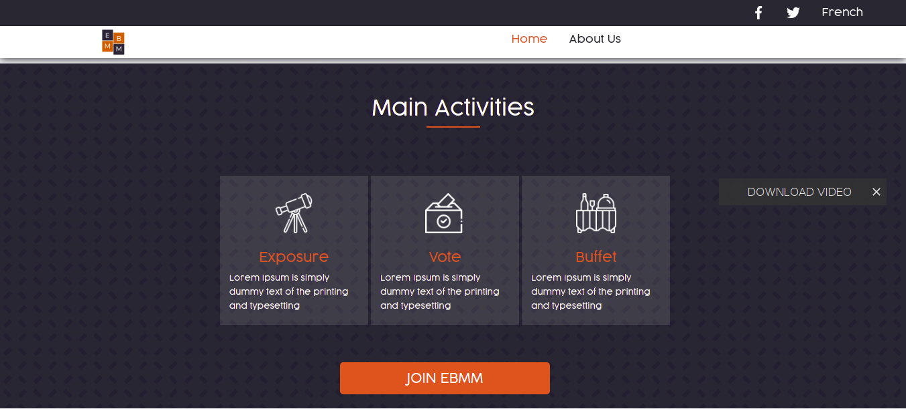
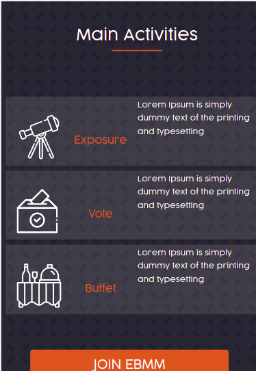

# CAPSTONE PROJECT AND APPLICATION DEPLOY

This project is one of the projects from my Microverse portfolio that aims to show you my skills in web design and responsive design. This project is based on an online website for a conference

 
 

## Built With

- HTML5
- CSS3
- CSS GRID AND FLEXBOX
- LINTERS FOR HTML/CSS
- JAVASCRIPT

## Live Demo

[Live Demo Link](https://azy64.github.io/Portfolio/)

## Authors

👤 **AZARIA SAIDI ALLY**
- GitHub: [@azy64](https://github.com/azy64)
- LinkedIn: [LinkedIn](https://www.linkedin.com/in/azaria-saidi-524780112/)

## 🤝 Contributing

Contributions, issues, and feature requests are welcome!

Feel free to check the [issues page](../../issues/).

Give a ⭐️ if you like this project!

## Acknowledgments

-  Cindy Shin in Behance.

## 📝 License

This project is [MIT](./MIT.md) licensed.
